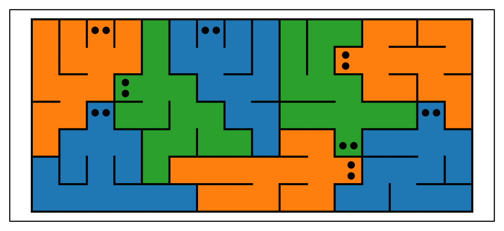

# HaringEscherCPsat

This is a hobby project that uses Constraint Programming and some recursion to generate artistic images. They are inspired by the work of Keith Haring (for their aesthetics) and MC Escher (for their pattern structure). The goal is to create large interlocking patterns of organic shapes. But unlike in Escher's work, and more like in Haring's work, we don't want translational symmetry (or repetition).

# Getting started

First, clone this repo or download a zip file and extract it, then open the project with your favorite IDE.
This project only uses three standalone packages, and their own prerequisites. These are `numpy`, `matplotlib`, and Google's `ortools`. I suspect Numpy is in fact a prerequisite of OR-Tools, but I'm mentioning it separately just in case.
Install them from the terminal with the command `pip install requirements.txt`, or navigate to them by hand if your IDE has integrated package management.

Once these packages are working, an example script utilizing the main functionalities can be found in `main.py`. Set the `MODE` parameter to 0,1 or 2, and run the script.
Take note that the script may take some minutes to terminate, if mode 0 or 1 are chosen for the demo.

### What this repo does

This repo contains scripts to generate tesselated figures without repetition, and to plot them. I will call this the Tiling Problem. See an example below.
In the example, faces were added later for clarity (and shits and giggles.)


The logic is contained in the `src` directory.

The starting point should be the `permutation_optimizer.py` and `classes.py`. 
These contain a set of classes and functions to define figures in terms of cells on a grid, and juxtaposition constraints on those cells.
Notably, there are no explicit constraints on the actual placement of each cell, though by construction it must lie inside a certain rectangular area.

These scripts can be used to create interlocking figures of little men with variable arm, torso, and leg length, or worms of varying length. 
They can also be modified to allow for figures of a different topology than lines or bipeds. However, figures of over 100 cells will not easily converge with a reasonable time (some hours).

The more advanced, but also more constrained in functionality, is `set_covering_optimizer`. it generates a ribbon shaped image of interlocking man-tiles. 
This contains a class that interacts with the google OR-tools CPsat solver in a recursive manner to perform a tree search on a subset of the solution space, only solving the tiling in one local chunk at a time.
This way, in principle the runtime should be approximately linear in the size of the area covered, assuming one is not too strict on the exact size of the image at the point of termination.

Finally, there is a script that applies a coloring to a solution to the tiling problem, such that no neighboring tiles have the same color. 
This is always possible with at most 4 colors, due to the four-color theorom. Hence the name `four_color_thm.py`.

Now let's look at the math / CS behind these two ways to describe the tiling problem, the _permutation_ and the _set covering_ formulations.

# Permutation Optimizer

The mathematical formulation of this approach is the following: 


Consider a finite, square grid of cells (pixels), on which we wish to tesselate figures. The width of the grid is `X`. The figures consist of neighboring cells. However, the pattern need not have repetition or any kind of translational symmetry.

A proposed representation of the grid is to have a single integer coordinate `w`, starting at 0, and wrapping around the grid in horizontal shelves or rows. For the case of width `X=7`, it would look like:

| 0 | 1 | 2 | 3 | 4 | 5 | 6 |
|---|---|---|---|---|---|---|
| 7 | 8 | 9 | 10 | 11 | 12 | 13 |
| 14 | 15 | 16 | 17 | 18 | 19 | 20 |
| 21 | 22 | 23 | 24 | 25 | 26 | 27 |
| 28 | 29 | 30 | 31 | 32 | 33 | 34 |


Then the mapping to 2d is the obvious

    x(w)  =  w % X
    y(w)  =  floor(w/X)

Let us define a _tile_ as a tuple of an integer `n`, the number of cells in the tile, and a set of edges `E` of neighboring cells indices.

    n  =  14 
    E  =  (0,1), (1,2), (2,3), (3,4), (1,4), (4,5), (1,6), (6,7), (3,8), (8,9), (9,10), (3,11), (11, 12), (12,13)

Let us use this tile above as the motivating example: a man-shaped tile (man-tile) with torso length of 3 cells, arm length of 2 cells, and leg length of 3 cells. In one specific folding, it looks like the image below.
Remember that the numbers on this figure are not the `w` coordinate, but the index counting along the cells of this tile. So the head of the man has w-coordinate `w[0]`.


The constraint programming formulation is when we take the intuitive demands, valid independently for each tile.

    |w[i] - w[j]|  =  1 or X            for all (i,j) in E
    (w[i] + w[j] + 1) % X  !=  0        for all (i,j) in E

The first demand is simply the juxtaposition. If `w[i]-w[j]` is +1 or -1, the two cells are left and right. If it is +X or -X, they are vertically stacked.
The only caveat is that we don't want them to be in subsequent grid points, if those points are exactly on either side of the boundary (i.e. 6 and 7 in the example). That is the function of the second constraint.

Furthermore, we must create a set of `w[i]` integer variables for each tile, and all of the `w`'s must be distinct, so no tiles overlap.

    w[a][i]  !=  w[b][j]                for all tiles a,b, for all indices i,j

Google OR-Tools has an `AllDifferent` demand that the solver handles efficiently, immediately reducing the state space as to permutation problem. Hence the name of the module. If we create the variables to have minimum 0, and maximum the last square on the grid `w_max`,
and furthermore, we have `m` tiles, then `m*n=w_max+1` uses every cell on the grid exactly once. It turns out, that still not all grids that satisfy this have a solution. For instance, a 14x7 grid with 7 man-tiles has no solution, but 14x6 (6 tiles) and 14x8 (8 tiles) do.

As a small point of aesthetics, I have also added a _double juxt_ constraint between indices 0 and 2. This forces the arms to be on either side of the torso, with the head between them, and the hips as well, making it much easier to recognize as a human.

This is a constraint problem and there is no objective function. A satisfying solution is all that is required. In this representation, Google OR-tools seems to cap out (on my local machine) at a 14x8 grid: then there are 112 variables, and the state space cardinality is upper bounded by 112!, which is of course quite large. 

### Scripts

The central objects are the `TileSolver` from `permutation_optimizer.py` and `Tile` class from the `classes.py` file.

The `Tile` class is intended as a kind of superclass for all shapes of tiles that can be tesselated. However, instances are not obtained by inheritance,
but by specific class methods `make_man` and `make_worm`, that return an instance of the class with the correct parameters. The first creates a man-tile.

- `Tile.make_man()`
  - arguments:
    - `torso_length`: int, the number of cells connected to the head that form the torso.
    - `arm_length`: int, the number of cells per arm
    - `leg_length`: int, the number of cells per leg.
  - returns: An instance of the `Tile` class with properties:
    - `n_indices`: int, equalling `torso_length` + 2 * `arm_length` + 2 * `leg_length` + 1
    - `juxt_index_list`: list, with the appropriate edges connecting the body parts 
    - `double_apart_list`: list, equals [(0,2)], forcing the head opposite the hips.
    - `thickness`: list, of thickness (float) per cell for rendering the body parts organically by plotters.
    - `eyes`: list, containing placement (relative to the center of the cell) of markings that serve as eyes. In this case, on the cell at index 0, facing away from the cell at index 1. The base orientation is with the reference cell below the eyes.
    
`Tile.make_worm()` is a similar function returning a tile without splitting in its topology.

- `Tile.make_worm()`
  - arguments:
    - `length`: int, the number of cells connected to the head that form the entire worm.
  - returns: An instance of the `Tile` class with properties:
    - `n_indices`: int, equalling `length`
    - `juxt_index_list`: list, with the appropriate edges connecting each index to the next.
    - `double_apart_list`: list, empty: no constraints on the shape.
    - `thickness`: list, of thickness (float) per cell
    - `eyes`: list, containing information of where to plot markings that serve as eyes, on the cell at index 0, facing away from index 1.

The way to utilize this class is to make a list of `Tile` instances, and feed that list into the `TileSolver` class. This class is intended to solve the tiling problem.

- `TileSolver.__init__()`
  - arguments:
    - `include_tiles`: list, containing `Tile` instances you want to jigsaw into the grid.
    - `X_width`: int, the wrapping parameter for the grid in the 1-D representation
  - returns: An `TileSolver` instance initialized with a constraint solver. Notable properties:
    - `include_tiles`: list, containing the tile instances.
    - `model`: cp_model.CpModel()
    - `sols_pos`: list, now empty, but containing the tile positions after solving.

Then we must call

- `TileSolver.construct_model()`
  - arguments:
    - `w_start`: int, optional, the minimal `w` coordinate. Default 0.
    - `w_max`: int, optionalm the maximal `w` coordinate. Default exactly fitting the tiles used in initialization.
  - returns: 
    - Nothing, but constructs all variables for each cell of each tile, and adds the constraints as defined above to the model. 
  - notes:
    - It is possible to solve on a larger grid than necessary, then some cells will be empty. 
    - We can also jog the grid using the optional params, so the solutions start later. This way, one solution can be in domain `[0,w*)`, and the next in `[w*,w**)`. With some extra work, these can be pasted together, reducing the global complexity.

And finally, call

- `TileSolver.solve()`
  - arguments:
    - None
  - returns: Nothing, but solves the model, and if feasible, 
    - plots the result using the `plot_tile` function from the `plotter.py` file.
    - updates with the true `w` coordinates the `position_list`, `juxt_position_list` of each `Tile` instance in `include_tiles`. 
    - updates the `sols_pos` list with the (x,y) coordinates of each cell of each tile.
    - Outputs the solution to a json file and saves it in the `jsons` directory.

# Set Covering Optimizer

Intuitively, another way to approach this problem is like a jigsaw puzzle. Instead of folding a single tile in all allowed ways, let us find all possible foldings and rotations, and then attempt to fit them together to exactly cover the grid.
This moves complexity away from the solving, and into the formulation of the constraint program problem, and is a typical reframing. Now the question becomes a set-covering problem.

Let us consider the points on the grid. They form a set `S`.


|     | x=0 | x=1 | x=2 | x=3 | x=4 | x=5 |
|---|----|-----|---|---|---|---|
| y=0 | 0,0 | 1,0 | 2,0 | 3,0 | 4,0 | 5,0 |
| y=1 | 0,1 | 1,1 | 2,1 | 3,1 | 4,1 | 5,1 |
| y=2 | 0,2 | 1,2 | 2,2 | 3,2 | 4,2 | 5,2 |
| y=3 | 0,3 | 1,3 | 2,3 | 3,3 | 4,3 | 5,3 |

And additionally, we have at our disposal, a set of _subsets_ of `S` of points,

    S_0  =  {(x_0_0, y_0_0), (x_0_1, y_0_1), (x_0_2, y_0_2), ... }
    S_1  =  {(x_1_0, y_1_0), (x_1_1, y_1_1), (x_1_2, y_1_2), ... }
    ...  =  ...

etc. If these subsets `S_i` are well-chosen, then it will be possible to each grid point in `S` covered by 
exactly _one_ of the `S_i`'s. So let the `S_i` be the collection of points that would be covered by any possible way to fold, rotate, and translate the tiles.

Then the model we need to solve is the following: choose a Boolean variable for each set. `v_j`. If `v_j==1`, this means including the subset in the set cover. Otherwise, exclude it.
Now let `I_xy` be the collection of all indices `i` such that point `x,y` is in `S_i`.

    (Sum v_i for all i in I_xy)  <=  1,         for all (x,y) in S
    (Sum v_i for all i)  =  m,

where `m` is the total number of tiles to be used. If `|S| = n*m`, for `n` the number of cells in each tile, then the first line will be equality: all grid points are needed.
We can also make a distinction between points that _have_ to be covered and those that are optional. For the required points, the first line is a strict equality. This will be useful later on. 

By the way, please excuse the awkward avoiding of math formatting. But I hope the intention is clear.

This model is simple enough. In order to construct it in Python, we need the sets `S_i`. We can go about this in at least two ways:

1. Prescriptive: Find all solutions of the permutation formulation of the Tiling Problem, constricting the solution to align with e.g. the top and left boundary. Then throw away equivalent (left-right symmetric) solutions.
2. Generative: Generate all solutions by a branching algorithm that starts with e.g. the head, and grows outward by placing each subsequent cell in all possible free spots. Then add rotations and reflections.

In this repo, both are implemented, and for the case of the man-tile of `n=14` described above, both produce 6124 foldings of the man tile. 

However, this technique does not significantly outperform the permutation representation. There are only dozens of constraints, and each variable is boolean. But with translations of the foldings, there are still tens- to hundreds of thousands of these variables.
We must find a way to solve the program locally on a subset of the grid, and patch together such solutions.

### Tree search of Tiling Problem solution space.

The approach taken in this repo is to fill a grid in a strip with tesselated tiles in separate _chunks_ moving from left to right.

To this end, we begin by appointing required, and optional points on the grid, like so:

|     | x=0 | x=1 | x=2 | x=3 | x=4 | x=5 |
|---|-----|-----|-----|-----|-----|-----|
| y=0 | R   | R   | R   | O   | O   | .   |
| y=1 | R   | R   | R   | O   | O   | .   |
| y=2 | R   | R   | R   | O   | O   | .   |
| y=3 | R   | R   | R   | O   | O   | .   |

For the required points `S_R` we create constraints as

    (Sum v_i for all i in I_xy)  =  1,         for all (x,y) in S_R

For the optional points `S_O`, create one more boolean variable `o_xy`, to describe whether they are covered, and add

    (Sum v_i for all i in I_xy)  =  o_xy,         for all (x,y) in S_O

Furthermore, we add constraints that prevent gaps that are unlikely to be filled, so

    o_xy  >=  o_(x+1)y

For pairs of points if both are present in `S_O`. Let the pair `S_R` and `S_O` be associated with a chunk.

When a solution is found, we can easily read off which optional points are unused, and add them to the next set of required points:

|     | x=3 | x=4 | x=5 | x=6 | x=7 | x=8 | x=9 |
|---|-----|-----|-----|-----|-----|-----|---|
| y=0 | R   | R   | R   | R   | O   | O   | . |
| y=1 | .   | R   | R   | R   | O   | O   | . |
| y=2 | .   | .   | R   | R   | O   | O   | . |
| y=3 | .   | R   | R   | R   | O   | O   | . |

There are two tricky bits:
1. We can only use tile foldings that fit entirely in the chunk. There may be points not covered by any possible tile, and then the chunk is infeasible a priori.
2. Even if we cover all grid points with at least one prospective tile, there isn't always a solution to the set covering problem that has only one tile on each grid point, and a tile over all required points.
If we reach a chunk in the algorithm that has no solution, we must backtrack to the previous chunk, and move to the next solution on that previous chunk. Then the set of grid points on the current chunk will change, and we can attempt to solve again.

This calls for a recursive algorithm that performs a depth first search. Starting from a certain depth, we can attempt to solve with the right edge straight, with only required points, and `S_O` empty:

|     | x=15 | x=16 | x=17 | x=18 | x=19 | 
|---|------|------|------|------|------|
| y=0 | .    | .    | R    | R    | R    |
| y=1 | .    | .    | .    | R    | R    |
| y=2 | .    | .    | R    | R    | R    |
| y=3 | .    | .    | .    | .    | R    |

If a solution is found, the search is terminated, and the solution is returned. If not, we can either backtrack to a different solution of the previous chunk, or add more chunks. 

An example (for which the data can be found in the jsons directory) places 3 tiles per chunk, and terminates in a smaller third chunk. 

Chunk 1:

Chunk 2:

Chunk 3:


This example omits the first 4 failed solutions at chunk 1 (solutions were found that didn't allow for a feasible 2nd chunk, or even for a cover on all grid points). On the last branch of chunk 1, there was one failed solution on chunk 2 which could not terminate. Then on the second solution of chunk 2, chunk 3 could finally terminate with a straight edge.

Here is the search tree in a diagram:

```
    Start  |  Chunk 1     |  Chunk 2     |  Chunk 3    |   Termination
    Start --> solution 1 --> infeasible
          --> solution 2 --> gridpoints without cover
          --> solution 3 --> infeasible
          --> solution 4 --> infeasible
          --> solution 5 --> solution 1 --> infeasible
                         --> solution 2 --> solution 1 --> Termination
```


### Scripts

On to the implementation of this algorithm.
The central objects are the `SolutionCollector` from `set_covering_optimizer.py` and `Tile` class from the `classes.py` file.

The `Tile` class is the same as in the permutation optimizer. The `SolutionCollector` class is intended to collect, one by one, the solutions to the set covering problem of a given chunk.
In order to be able to recurse upon finding a solution, using Google OR-tools, we must create a class that inherits from `cp_model.CpSolverSolutionCallback`. These can be passed to the solver as a _Callback object_. When we choose the setting `search_all_solutions=True`, the solver will keep searching until ALL feasible solutions have been visited. Each hit, it will call the `on_solution_callback` of the callback object.
The trick in this repo, is that the `SolutionCollector` class is also responsible for constructing the model, solving it (passing itself as its own Callback object), and then recursively creating more instances of itself on every callback, to search through the tree of chunks until it terminates. The objects share a common config that can communicate between them, and knows when the search has terminated successfully.

Here is the search tree of the example above, but in terms of the most important objects and methods and their recursion, printed in pseudocode, so omitting steps and arguments.

```
s1 = SolutionCollector()  # to solve chunk 1
s1.construct_variables()
s1.construct_constraints()
s1.solve_myself() # passing self as callback
    s1.on_solution_callback() # solution 1 creates new SolutionCollector instance, to solve chunk 2
        s2 = SolutionCollector()
        s2.construct_variables()
        s2.construct_constraints()
        s2.solve_myself() # passing self as callback
            # chunk 2 infeasible
    s1.on_solution_callback() # solution 2 creates new SolutionCollector instance, to solve chunk 2
        s2 = SolutionCollector()
        s2.construct_variables()
        s2.construct_constraints()
            # uncovered grid points on chunk 2: infeasible a priori
    s1.on_solution_callback() # solution 3 creates new SolutionCollector instance, to solve chunk 2
        s2 = SolutionCollector()
        s2.construct_variables()
        s2.construct_constraints()
        s2.solve_myself() # passing self as callback
            # chunk 2 infeasible
    s1.on_solution_callback() # solution 4 creates new SolutionCollector instance, to solve chunk 2
        s2 = SolutionCollector()
        s2.construct_variables()
        s2.construct_constraints()
        s2.solve_myself() # passing self as callback
            # chunk 2 infeasible
    s1.on_solution_callback() # solution 5 creates new SolutionCollector instance, to solve chunk 2
        s2 = SolutionCollector()
        s2.construct_variables()
        s2.construct_constraints()
        s2.solve_myself() # passing self as callback
            s2.on_solution_callback() # solution 1 creates new SolutionCollector instance, to solve chunk 3
                s3 = SolutionCollector()
                s3.construct_variables()
                s3.construct_constraints()
                s3.solve_myself() # passing self as callback
                    # chunk 3 infeasible
            s2.on_solution_callback() # solution 2 creates new SolutionCollector instance, to solve chunk 3
                s3 = SolutionCollector()
                s3.construct_variables()
                s3.construct_constraints()
                s3.solve_myself() # passing self as callback
                    s3.on_solution_callback() # solution 1 terminates: we have reached the desired depth and a straight edge.
                    s3.solved = True # terminate 
                s3.stop_search()
            s2.solved = True # terminate
        s2.stop_search()
    s1.solved = True # terminate
s1.stop_search()
s1.output_solution()
```

The `SolutionCollector` class is initialized using a `RecurseConfig` instance. This is a simple class that contains the configuration of the search, and the termination condition. It is passed to the `SolutionCollector` instance, and then to all new instances created by the callback for consistency.
It has the following properties:

- `RecurseConfig.__init__()`:
  - arguments:
    - `dx_per_iter`: int in [2,10], the number of cells to move the right boundary of the chunk per iteration.
    - `y_width`: int in [2,20], the number of cells in the y direction, or the height of the strip to fill.
    - `min_x_bdy`: int in [`dx_per_iter`,50], the minimal x coordinate to try to terminate the search with a straight right boundary.
    - `max_x_bdy`: int in [`min_x_bdy`, 100], the maximal x coordinate to try to terminate the search with a straight right boundary.
    - `optional_delta`: int in [1,10], the width of the band of optional points on the right boundary, i.e. the maximum horizontal variation in the jagged edges of the chunks.
  - returns: A `RecurseConfig` instance with the above properties, and the following flag:
    - `solved`: bool, whether the search has terminated successfully. This is how the recursion levels communicate with each other and terminate in a coordinated fashion.
  - notes:
    - The `dx_per_iter` is the most important parameter. Too small, and there will be no feasible solutions. Too large, and the search will be slow.
    - A higher `optional_delta` will make the search slower, but more likely to find a solution. Also if it is set to 1, the boundaries of the chunks will be artificially flat.

Then we must initialize a `SolutionCollector` instance, and pass it the `RecurseConfig` instance.

- `SolutionCollector.__init__()`
  - arguments:
    - `recurse_config`: RecurseConfig instance, containing the configuration of the search.
  - returns: A `SolutionCollector` instance with, besides the `RecurseConfig` object (`self.rc`), the following properties that are filled in procedurally during recursion:
    - `rounding_up`: int, if zero, this chunk will not attempt a straight edge but will have optional gridpoints. If positive, it means this chunk will attempt to terminate the search with a straight edge of required points at the right boundary at a distance `rounding_up` from the previous chunk.
    - `left_bdy`: int, the left boundary of the chunk.
    - `target_x_bdy`: int, the first x coordinate to attempt to terminate the search with a straight edge. If not possible, the next chunk will have a larger value, until `rc.max_x_bdy` is reached.
    - `skip_optional_pts`: set, containing the optional points from the previous chunk that were covered, and should be subtracted from the set of required points of the current chunk.
    - `grouper_of_men`: `GrouperOfMen` instance, an auxiliary object that generates all possible foldings and translations of tiles.

Then, in order, we must call the following methods:

1. `SolutionCollector.construct_variables()`
2. `SolutionCollector.construct_constraints()`
If this method returns a `True`, there is a total cover of the grid, and we continue with
3. `SolutionCollector.solve_myself()`
if the search terminates successfully, the method
4. `SolutionCollector.output_solution()`
will save the solution to a json file in the `jsons` directory and plot it using a plotter, to be described later.

Let us go over the function of each of these methods.

- `SolutionCollector.construct_variables()`
  - arguments:
    - None
  - returns: Nothing, but constructs the variables for the set covering problem, and stores them in the `SolutionCollector` instance. 
  - notes:
    - The variables are the `v_i`'s, and the `o_xy`'s.
    - The `v_i`'s are the boolean variables for inclusion of each tile subset. Tiles that do not fit in the chunk are skipped from the state space.
    - The `o_xy`'s are the boolean variables for the cover of each optional point.

- `SolutionCollector.construct_constraints()`
  - arguments:
    - None
  - returns: boolean, if `True`, there is a cover of all grid points, and the solver can be invoked. If `False`, the chunk is infeasible. 
  - notes:
    - There is one constraint per grid point, and one extra for the total number of used tiles.
    - Some ad-hoc additional constraints prevent thin peninsulas in the optional points as they empirically prevent a grid cover in the next chunk.

- `SolutionCollector.solve_myself()`
  - arguments:
    - None
  - returns: boolean, `True` if a solution was found (useful for curtailing some of the search), `False` if failed. 
  - notes:
    - Will find all solutions of the set covering problem, (or fewer if halted asynchonously), and calls the `on_solution_callback` method of the `cp_model.CpSolverSolutionCallback` subclass.
    - The method is called with the `self` instance as a callback object, and the solver will call the `on_solution_callback` method of the Callback object when a solution is found.

- `SolutionCollector.on_solution_callback()`
  - arguments:
    - None
  - returns: Nothing, but it will create a new `SolutionCollector` instance to solve the next chunk. 
  - notes:
    - The method is called by the solver when a solution is found. 
    - It will then create a new instance of `SolutionCollector` to solve the next chunk, or terminate the search if `self.rounding_up` > 0 and the right boundary is straight.
    - If the search has terminated, it will set the `solved` flag of the `RecurseConfig` object to `True`. When that flag is true, all instances of `cp_model.CpSolverSolutionCallback` in higher levels of recursion will terminate using `self.stop_search()`.

- `SolutionCollector.stop_search()`
  - arguments:
    - None
  - returns: Nothing
  - notes:
    - This method is inherited from `cp_model.CpSolverSolutionCallback`, and is used to halt the search asynchronously. It is the only way to produce a strict subset of the solutions.

- `SolutionCollector.output_solution()`
  - arguments:
    - None
  - returns: Nothing, but it will save the solution to a json file in the `jsons` directory and plot it using a plotter.
  - notes:
    - The first key the json contains is `tiles`: a list of lists of (x,y) coordinate tuples of cells: each list is a tile. 
    - The second key is `juxt_index_list`: a list of lists of tuples of indices, each list is a tile, and the inside list tabulates which cells are connected.
    - The plotter will plot the solution, and save it as a png file in the `images` directory.

Another object that is central to the set covering approach is the `GrouperOfMen` class, from the `generative.py` script. It is used to generate all the foldings of tiles of men. These are used as the subsets from the problem formulation. These tiles specifically have `torso_length`=3, `arm_length`=2, and `leg_length`=3.
These values are hardcoded. This was done with care to have an independent verification of the set of solutions from the permutation optimizer. It is not straightforward to generalize to arbitrary body dimensions: when limbs become long enough, the order in which they are placed becomes important: we must prevent the right arm from taking up space that would make the left arm infeasible, etc.

After producing all foldings, these are rotated, and there are methods to group them by their outline (the set cover only cares about the used cells, not their interconnectivity), and translate them over the grid along the x and y axes.

- `GrouperOfMen.__init__()`
  - arguments:
    - None
  - returns: A `GrouperOfMen` instance with the following properties:
    - `all_foldings`: a list of 2d numpy arrays with all possible foldings of the 3-2-3 man-tile. This includes rotations.
    - `grouped_by_outline`, a dictionary grouping the above list by the folding `Outline`, or the set of cells it occupies. 
  - Notes:
    - The `Outline` is an auxiliary hashable class created as a many-to-one mapping from tile foldings. This is also modulo translations. There are 6124 foldings, and about 5k outlines of 3-2-3 men, reducing the complexity of the problem somewhat.
    - When a tile is placed in the set covering problem, technically we first only place an `Outline`. We then select a random element (actual folding) of the list corresponding to that key in the `grouped_by_outline` dict, and place that tile into the solution.


- `GrouperOfMen.get_all_men_plus_translations()`
  - arguments:
    - `x_left`: int, the leftmost x coordinate of the chunk
    - `x_right`: int, rightmost x coordinate of the chunk
    - `y_bottom`: int, the bottom y coordinate of the chunk
    - `y_top`: int, the top y coordinate of the chunk
  - returns:
    - `all_translations`: a dict with `Outline`s as keys, and a 4D numpy array as values. The array contains all translations that lie completely within the box in the arguments.
    - `self.grouped_by_outline`, the variable from the `__init__()` method.
  - Notes:
    - Tile foldings are represented as 2D numpy arrays. The translations replicate these for all applicable x- and y-translations. The first index of the array moves through the various x-translations. The second through the y-translations. The third iterates over the cells of the tile, and the fourth is the (x,y) tuple of each cell.
    - Not all translations will actually fit in the chunk, but this method returns all candidates. They will be discarded later if they have any cells that fall outside the grid.

# Four-color theorem

This is a small module that uses constraint programming (Google OR-tools) to find a coloring of solutions to the tiling problem that use only four (or sometimes three) colors. 
It works by finding which tiles neighbor each other, then creating demands that neighbors cannot share the same color. Finally, it optimizes such that the presence of least-represented color is maximized, ensuring that there are approximately the same number of each color.
It's found in the `four_color_theorem.py` script.

Typically, we would choose optimization variables `c_i` in e.g. {0,1,2,3} for each tile. But because of the objective, it is more natural to construct boolean variables to signal the pairing of each possible color to each tile `c_i_j` in {0,1} for `i` the tile index and `j` the color index. 
The condition that neighbors have distinct colors is,
for each pair of neighboring tiles `i` and `k`,

    c_i_j + c_k_j <= 1       for each color j

And each tile must have exactly one color,

    sum_j c_i_j = 1           for each tile i

Then the number of tiles of color `j` is the sum of `c_i_j` over all `i`. OR-tools can then include a minimum-equality (which could also be achieved with a set of inequalities) to ensure that the least-represented color is maximized.

If possible, the script will output a coloring with 3 distinct colors. This is not always possible, in which case the script will move on to 4 colors.
To interact with this module, simply call the function:

- `get_color_indices()`
  - arguments:
    - `sols`: list of numpy arrays, each array is a tile, with the (x,y) coordinates of the cells in the tile.
  - returns:
    - A list of integers, in the same order as the tiles in the input list. Each integer represents a unique color, and this list can be entered into the plotting functions below.

# Plotters

There are two plotting styles: geometric with only squares, and one using Bezier curves that is more faithful to the Keith Haring aesthetic.
The logic can be found in the `plotter.py` script. Only the Matplotlib library is used.

The more elementary geometric plotter is written in terms of the wrapping coordinate `w` from the permutation representation.

- `plot_tile()`
  - arguments:
    - `cell_list`: list of integers, the `w` coordinates of the cells in the tile.
    - `separate_list`: list of tuples of indices, the pairs of `w` coordinates of cells that should be separated by a line. Only neighboring cells should be present.
    - `eye_list`: list of pairs: a `w` coordinate of the cell on which to place eyes, and as second element a list of (x,y) floats, coordinates relative to the cell center.
    - `x_width`: int, the width of the grid: at what `w` coordinate the grid wraps around.
    - `y_height`: int, the height of the grid in the same units as `w`.
    - `color_list`: list of ints, which indicate the colors of the cells. We use 10 basic colors, then cycle around.
    - `eye_size`: int, default 20: the size of the markers used to plot the eyes
    - `save_dpi`: int, default 2000: the resolution of the saved image.
  - returns: Nothing but displays the solutions and saves the image in the `images` directory as `KH_XXX_Y.png`, where `XXX` is the number of cells present, and `Y` is a unique counting number to prevent overwriting.

The style is the one used in the example images above.

Starting from a list of solutions in terms of numpy arrays (so using the (x,y)-representation, not the `w` representation), one can invoke this function through the `Tile` class.
Simply create an instance of the tile, for instance using `Tile.man()`, that is of the same type as all the tiles in the solution. It will not work for mixed types. 

- `Tile.plot_square_style()`
  - arguments:
    - `sols`: list of numpy arrays, each array is a tile, with the (x,y) coordinates of the cells in the tile.
    - `color_list`: optional list of ints, which indicate the colors of the individual _tiles_. If omitted, they cycle through the 10 available colors.
  - Notes:
    - If you want to plot mixed instances of tiles from a saved list: you have to implement that yourself. 

The Bezier plotter is more complex. It requires decomposing the topology of the tiles into a series of Bezier curves. We want to round corners, but not disconnect at the joints.
Thus we need to understand the tiles as a collection of _strands_, or line segments (series of vertices connected by edges) that terminate in either a leaf or a split. This is done recursively unsing the `get_strands()` function from the `utils.py` script. That means it will work for any other tile instance you may design.

From the `plotter.py` script, the function is

- `plot_bezier_style()`
  - arguments:
    - `strands`: list of lists of tuples of floats, the (x,y) coordinates of the vertices of the strands.
    - `colors`: list of ints, which indicate the colors of the strands. We use 10 basic colors, then cycle around.
    - `widths`: list of lists of floats, the width of the strands. The outer list is per strand, the inner list per vertex.
    - `eyes`: list of tuples of floats, the absolute (x,y) coordinates of the eyes.
    - `smoothing_param`: float in [0,1), what proportion of the corners of segment to replace by a bezier curve. Default 0.5. Higher values make the curves smoother. At zero, we recover straight angles.
    - `width_factor`: float, the factor by which to multiply the width of the strands. Default 10. Should be used to control the thickness, which presents differently with different canvas sizes
    - `save_dpi`: int, default 2000: the resolution of the saved image.
  - returns: Nothing but displays the solutions and saves the image in the `images` directory as `KH_XXX_bezier_Y.png`, where `XXX` is the number of strands present, and `Y` is a unique counting number to prevent overwriting.

Again, from a list of solutions, one can invoke this function through the an instance of the `Tile` class.

- `Tile.generate_strands_and_plot_bezier()`
  - arguments:
    - `sols`: list of numpy arrays, each array is a tile, with the (x,y) coordinates of the cells in the tile.
    - `color_list`: optional list of ints, which indicate the colors of the individual _tiles_. If omitted, they cycle through the 10 available colors.
    - `width_factor`: float, the factor by which to multiply the width of the strands. Default 3.5. Should be used to control the thickness, which presents differently with different canvas sizes.
    - `smoothing_param`: float in [0,1), what proportion of the corners of segment to replace by a bezier curve. Default 0.5. Higher values make the curves smoother. At zero, we recover straight angles.